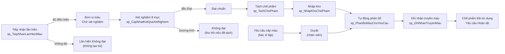

# Hướng dẫn sử dụng – Hệ thống Quản lý Ngân hàng, Điều chuyển và Hiến máu

Giao diện web cho đồ án môn Quản lý thông tin (Nhóm 4). Web đọc và ghi trực tiếp vào cơ sở dữ liệu SQL Server
được tạo bởi `sql/QuanLyNganHangMau.sql`. **Mọi thao tác ghi dữ liệu đều đi qua stored procedure** có trong
script; ngoại lệ duy nhất là "Duyệt yêu cầu cấp máu" (theo mục kiểm tra 2.2 của script).

Trên web, mỗi màn hình có nút **Hướng dẫn** (góc phải thanh menu) mở khung mô tả chức năng của màn hình đó,
các đối tượng SQL bị tác động và luồng nghiệp vụ – cùng nội dung với tài liệu này.

## Mục lục

1. [Giới thiệu](#1-giới-thiệu)
2. [Cài đặt và chạy](#2-cài-đặt-và-chạy)
3. [Tài khoản và phân quyền](#3-tài-khoản-và-phân-quyền)
4. [Hướng dẫn từng màn hình](#4-hướng-dẫn-từng-màn-hình)
5. [Luồng nghiệp vụ và kịch bản demo](#5-luồng-nghiệp-vụ-và-kịch-bản-demo)
6. [Bảng tra cứu: đối tượng SQL → màn hình](#6-bảng-tra-cứu-đối-tượng-sql--màn-hình)
7. [Giới hạn và hướng phát triển](#7-giới-hạn-và-hướng-phát-triển)
8. [Phụ lục: các thay đổi so với script ban đầu](#8-phụ-lục-các-thay-đổi-so-với-script-ban-đầu)

---

## 1. Giới thiệu

Hệ thống số hóa vòng đời của một túi máu:

> người hiến → lần hiến → đơn vị máu → xét nghiệm → tách chế phẩm → lưu kho → yêu cầu cấp máu → phân bổ → truyền máu

| Thành phần | Công nghệ |
|---|---|
| Cơ sở dữ liệu | SQL Server 2022 – `sql/QuanLyNganHangMau.sql` (bảng, dữ liệu mẫu, procedure, trigger, function, cursor, phân quyền, báo cáo) |
| Phân quyền cho web | `sql/PhanQuyenWeb.sql` – bổ sung GRANT/DENY cho 3 nhóm người dùng |
| Giao diện | Next.js 16 (App Router), TypeScript, Material UI – thư mục `web/` |
| Kết nối | Driver `mssql` + `msnodesqlv8` (ODBC Driver 17, qua shared memory – không cần bật TCP/IP) |

```
QuanLyNganHangMau/
├── README.md                  ← tài liệu này
├── sql/
│   ├── QuanLyNganHangMau.sql  ← script CSDL của đồ án
│   └── PhanQuyenWeb.sql       ← cấp quyền cho 3 nhóm người dùng
└── web/                       ← mã nguồn giao diện
    ├── app/(app)/…            ← các màn hình sau đăng nhập
    ├── app/actions/…          ← thao tác ghi: mỗi hàm gọi đúng một procedure
    ├── lib/server/queries*.ts ← truy vấn đọc, tách theo vai trò
    └── lib/huongDan.ts        ← nội dung khung "Hướng dẫn" trên web
```

## 2. Cài đặt và chạy

**Yêu cầu:** SQL Server (bật SQL Server Authentication), ODBC Driver 17 for SQL Server, Node.js 22.

1. Trong SSMS, chạy `sql/QuanLyNganHangMau.sql` (tạo mới CSDL và dữ liệu mẫu).
2. Chạy `sql/PhanQuyenWeb.sql` (cấp quyền cho 3 nhóm người dùng).
3. Trong thư mục `web`: sao chép `.env.example` thành `.env.local` (giá trị mặc định đúng cho SQL Server cài trên máy).
4. `npm install` rồi `npm run dev`, mở http://localhost:3000.

> Muốn đưa dữ liệu về trạng thái ban đầu (ví dụ trước buổi demo): chạy lại bước 1 và 2.

## 3. Tài khoản và phân quyền

Mỗi tài khoản là một **SQL login** (Chương 4 · 2.1). Web đăng nhập SQL Server bằng chính tài khoản đó, nên
GRANT/DENY trong CSDL được áp dụng thật; web chỉ ẩn các nút mà vai trò không được dùng.
Dải **"Bản demo"** trên cùng cho phép chuyển nhanh giữa 3 vai trò.

| Tài khoản | Mật khẩu | Nhóm quyền (role) | Vai trò |
|---|---|---|---|
| nhanvien01 | NhanVien@2026 | role_NhanVienNganHangMau | Nhân viên ngân hàng máu |
| bacsi01 | BacSi@2026 | role_BacSi | Bác sĩ |
| quanly01 | QuanLy@2026 | role_QuanLy | Cán bộ quản lý |

### Quyền theo màn hình

| Màn hình | Nhân viên | Bác sĩ | Quản lý |
|---|---|---|---|
| Kho máu | Xem, nhập kho, cập nhật hết hạn, đồng bộ vị trí | Xem tồn kho | Xem (kể cả vị trí, lịch sử kho) |
| Hiến máu | Tiếp nhận, import, xem | – | Xem |
| Xét nghiệm | Nhập kết quả, tách chế phẩm | – | Xem |
| Yêu cầu cấp máu | Duyệt, tự động phân bổ (chỉ thấy mã bệnh nhân) | Xem yêu cầu, thấy tên bệnh nhân | Xem |
| Truyền máu | – | Ghi nhận ca truyền | Xem |
| Bệnh nhân | – | Xem | Xem |
| Báo cáo | – | – | Xem 5 báo cáo |
| Quản trị | – | – | Sao lưu; script phục hồi và export |

### Các GRANT/DENY tiêu biểu (`sql/PhanQuyenWeb.sql`)

| Nhóm | Quyền | Thể hiện trên web |
|---|---|---|
| Nhân viên | `DENY SELECT ON BenhNhan` | Danh sách yêu cầu chỉ hiện mã bệnh nhân |
| Nhân viên | `DENY SELECT ON TruyenMau` | Không có màn hình Truyền máu |
| Nhân viên | `DENY INSERT, UPDATE ON LichSuKho` | Lịch sử kho chỉ đọc |
| Nhân viên | `GRANT UPDATE (TrangThai) ON YeuCauCapMau` | Nút "Duyệt yêu cầu" |
| Bác sĩ | `DENY SELECT ON NguoiHienMau` | Không vào được màn hình Hiến máu |
| Bác sĩ | `DENY UPDATE ON YeuCauCapMau`, `DENY INSERT, UPDATE ON PhanBoMau` | Không có nút duyệt / phân bổ |
| Quản lý | `GRANT SELECT ON SCHEMA::dbo`, `DENY INSERT, UPDATE` trên bảng nghiệp vụ | Xem toàn bộ, không có nút ghi dữ liệu nghiệp vụ |
| Quản lý | `GRANT BACKUP DATABASE` | Nút "Sao lưu" |
| Cả 3 | `DENY DELETE ON SCHEMA::dbo` | Không có thao tác xóa – hủy chỉ là đổi trạng thái |

Các thao tác ghi đi qua procedure (`GRANT EXECUTE`); procedure cùng chủ sở hữu `dbo` nên vẫn ghi được vào
bảng mà người dùng không có quyền INSERT/UPDATE trực tiếp (chuỗi sở hữu).

## 4. Hướng dẫn từng màn hình

Ký hiệu vị trí trong script: **"C4 · 1.1.5"** = Chương 4, mục 1.1.5 trong `sql/QuanLyNganHangMau.sql`.

### 4.1. Đăng nhập

- Nhập tên đăng nhập/mật khẩu, hoặc bấm một tài khoản demo bên phải để điền sẵn.
- Web xác định vai trò bằng `IS_ROLEMEMBER('role_…')` và hiện menu tương ứng.
- **SQL:** CREATE LOGIN/USER (C4 · 2.1), CREATE ROLE + phân quyền (C4 · 2.2), `sql/PhanQuyenWeb.sql`.
- **Lỗi có thể gặp:** "Sai tên đăng nhập hoặc mật khẩu."

### 4.2. Kho máu

| Chức năng | Ai dùng | Thao tác | Tác động trong SQL |
|---|---|---|---|
| Xem tồn kho | Cả 3 | Ma trận 8 nhóm máu × 4 loại chế phẩm (ô xanh = còn hàng, ghi "số túi · ml"). Bấm ô để lọc danh sách; danh sách sắp theo hạn gần nhất (FIFO) | Truy vấn báo cáo tồn kho **C4 · 3.1 (phần A)**; đọc ChePhamMau, DonViMau, NhomMau, ViTriLuuTru, NganHangMau |
| Nhập kho | Nhân viên | "Nhập kho" → chọn chế phẩm chờ nhập → chọn vị trí → "Lưu nhập kho" | **sp_NhapKhoChePham (C4 · 1.1.1)**: kiểm tra sức chứa, gán vị trí, +1 tồn vị trí và ngân hàng, ghi LichSuKho "Nhập kho". **trg_ViTriLuuTru_KiemTraSucChua (C4 · 1.2.5)** |
| Cập nhật hết hạn | Nhân viên | Bấm "Cập nhật chế phẩm hết hạn" | **sp_CapNhatChePhamHetHan (C4 · 1.4.1, cursor)**: chế phẩm quá hạn → "Hết hạn", ghi LichSuKho "Kiểm kê" |
| Đồng bộ vị trí | Nhân viên | Tab "Vị trí lưu trữ" → "Đồng bộ trạng thái vị trí" | **sp_CapNhatTrangThaiViTriLuuTru (C4 · 1.4.2, cursor)**: đếm lại chế phẩm, cập nhật LuongHienTai và Đầy/Còn chỗ |
| Lịch sử kho | Nhân viên, quản lý | Tab "Lịch sử kho" (chỉ đọc) | Đọc LichSuKho; nhân viên bị DENY INSERT/UPDATE |

**Lỗi có thể gặp:** "Vị trí lưu trữ đã đầy!" (hiện ngay dưới ô Vị trí).

### 4.3. Hiến máu

| Chức năng | Ai dùng | Thao tác | Tác động trong SQL |
|---|---|---|---|
| Tiếp nhận lần hiến | Nhân viên | "Tiếp nhận lần hiến" → chọn người hiến (gợi ý tuổi, lần hiến gần nhất), đợt, ngày/giờ, lượng máu 250/350/450 ml, loại hiến, kết quả khám → "Tiếp nhận" | **sp_TiepNhanLanHienMau (C4 · 1.1.5)**: kiểm tra ≥ 18 tuổi, cách lần hiến trước ≥ 84 ngày. Đủ điều kiện → LanHienMau "Đã hiến" **và tạo DonViMau "Chờ xét nghiệm"** trong cùng transaction; không đủ → "Không đạt", không tạo túi máu. **trg_LanHienMau_KiemTraTuoi (C4 · 1.2.1)** |
| Tra cứu người hiến | Nhân viên, quản lý | Tab "Người hiến", tìm theo tên/CCCD/SĐT | **fn_TinhTuoi (C4 · 1.3.1)** cho cột Tuổi; đọc NguoiHienMau, LanHienMau |
| Import người hiến | Nhân viên | Tab "Người hiến" → nhập đường dẫn CSV trên máy SQL Server → "Import" | **sp_ImportNguoiHienMau (C4 · 2.3)**: BULK INSERT, bỏ qua bản ghi trùng mã/CCCD |
| Đợt hiến máu | Nhân viên, quản lý | Tab "Đợt hiến máu" | Đọc DotHienMau, LanHienMau |

Bảng "Lần hiến" có cột **Đơn vị máu**: bấm mã (ví dụ DV-0013) để sang màn hình Xét nghiệm của túi máu đó.

**Lỗi có thể gặp:** "Người hiến máu chưa đủ 18 tuổi!", "Khoảng cách từ lần hiến trước chưa đủ 84 ngày!",
"You do not have permission to use the bulk load statement" (import cần quyền ADMINISTER BULK OPERATIONS).

### 4.4. Xét nghiệm và tách chế phẩm

| Chức năng | Ai dùng | Thao tác | Tác động trong SQL |
|---|---|---|---|
| Nhập kết quả | Nhân viên | Chọn đơn vị máu bên trái (cột "Bắt buộc đạt", ví dụ 3/8) → chọn loại xét nghiệm, thời gian, kết quả, kết luận → "Lưu kết quả" | **sp_CapNhatKetQuaXetNghiem (C4 · 1.1.4)**: đủ 8 xét nghiệm bắt buộc đều Đạt → DonViMau "Đạt chuẩn"; có Dương tính/Không đạt → "Không đạt" và **thu hồi** chế phẩm đã tách |
| Tách chế phẩm | Nhân viên | Đơn vị "Đạt chuẩn" → form gợi ý loại theo loại hiến và ml còn lại → chọn loại, nhập thể tích thực tế → "Tách chế phẩm" | **sp_TachChePham (C4 · 1.1.6)**: chỉ tách từ đơn vị Đạt chuẩn; mỗi loại một lần; tổng thể tích ≤ túi; hạn dùng tự tính (hồng cầu 35 ngày, huyết tương 1 năm, tiểu cầu 5 ngày, tủa lạnh 6 tháng). Chế phẩm mới "Chờ nhập kho" |
| Xem | Quản lý | Chọn đơn vị để xem kết quả và chế phẩm đã tách | Đọc DonViMau, KetQuaXetNghiem, LoaiXetNghiem, ChePhamMau |

**Thu hồi khi kết quả không đạt về muộn** (ví dụ NAT trả sau 24 giờ): procedure hủy chế phẩm còn trong kho
hoặc đã cấp phát, hủy phân bổ chưa truyền (yêu cầu quay về "Đã duyệt"), trừ tồn kho, ghi LichSuKho "Tiêu hủy".
Nếu chế phẩm đã được truyền, web hiện **cảnh báo sự cố**.

**Lỗi có thể gặp:** "Thời gian trả kết quả phải sau ngày xét nghiệm!", "Chỉ tách chế phẩm từ đơn vị máu đã đạt
chuẩn xét nghiệm!", "Đơn vị máu này đã tách loại chế phẩm này!", "Tổng thể tích các chế phẩm vượt quá thể tích
đơn vị máu!", "Đã quá thời hạn bảo quản của loại chế phẩm này, không thể tách!".

### 4.5. Yêu cầu cấp máu

**Danh sách** (cả 3 vai trò): Cấp cứu xếp trước; dòng cần xử lý nổi, dòng đã đóng hiện mờ; lọc theo trạng thái
và khoa (bác sĩ mặc định lọc khoa của mình). Cột "Đã phân bổ" tính bằng **fn_TongTheTichDaPhanBo (C4 · 1.3.3)**.
Nhân viên chỉ thấy mã bệnh nhân (DENY SELECT BenhNhan).

**Chi tiết yêu cầu:**

| Chức năng | Ai dùng | Thao tác | Tác động trong SQL |
|---|---|---|---|
| Duyệt yêu cầu | Nhân viên | Yêu cầu "Chờ xử lý" → "Duyệt yêu cầu" | `UPDATE YeuCauCapMau SET TrangThai` (quyền cột – mục kiểm tra 2.2); bác sĩ bị DENY |
| Tự động phân bổ | Nhân viên | Yêu cầu "Đã duyệt" → "Tự động phân bổ"; thông báo nêu chế phẩm được chọn và lý do | **sp_PhanBoMauChoYeuCau (C4 · 1.1.2)**: chọn chế phẩm tương thích (bảng QuyTacTuongThich), còn hạn, hạn gần nhất – FIFO. **trg_PhanBoMau_KiemTraTuongThich (C4 · 1.2.2)**, **trg_PhanBoMau_CapNhatYeuCau (C4 · 1.2.3)** |
| Thông tin, tương thích | Cả 3 | Khung bên phải: bệnh nhân, khoa, mức ưu tiên, "Nhóm cho phù hợp"; bảng phân bổ có cột "Tương thích" | **fn_KiemTraTuongThich (C4 · 1.3.2)**, **fn_TinhTuoi**, **fn_TongTheTichDaPhanBo** |
| Sang ghi nhận truyền | Bác sĩ | Dòng chế phẩm đã phân bổ → "Ghi nhận truyền máu" | Xem 4.6 |

**Lỗi có thể gặp:** "Yêu cầu không tồn tại hoặc chưa được duyệt!", "Không tìm thấy chế phẩm phù hợp/tương thích
trong kho!".

### 4.6. Truyền máu

| Chức năng | Ai dùng | Thao tác | Tác động trong SQL |
|---|---|---|---|
| Ghi nhận ca truyền | Bác sĩ | Chọn phân bổ (mã ca truyền tự cấp, chỉ đọc) → giờ bắt đầu/kết thúc, thể tích, người thực hiện, phản ứng phụ, trạng thái → "Lưu ca truyền" | **sp_GhiNhanTruyenMau (C4 · 1.1.3)**: Hoàn thành → chế phẩm "Đã sử dụng", yêu cầu "Hoàn tất", trừ tồn kho, ghi LichSuKho "Xuất kho". **trg_TruyenMau_CapNhatChePham (C4 · 1.2.4)** |
| Xem các ca truyền | Bác sĩ, quản lý | Bảng "Các ca truyền máu" | Đọc TruyenMau (nhân viên bị DENY) |

Mã ca truyền: procedure nhận mã từ bên gọi (cột không phải IDENTITY), web cấp mã kế tiếp theo mẫu `TMxxx`.

**Lỗi có thể gặp:** "Thời gian kết thúc phải lớn hơn thời gian bắt đầu." (kiểm tra ngay khi nhập).

### 4.7. Bệnh nhân

Bác sĩ và quản lý xem danh sách bệnh nhân (chỉ đọc): nhóm máu, tuổi (**fn_TinhTuoi**), khoa, chẩn đoán, số yêu cầu.
Quyền: `GRANT SELECT ON BenhNhan TO role_BacSi` (C4 · 2.2).

### 4.8. Báo cáo (quản lý)

| Tab | Nguồn trong script | Bộ lọc |
|---|---|---|
| Tồn kho theo nhóm máu | Truy vấn **C4 · 3.1** (phần A: 32 dòng; phần B: theo ngân hàng máu) | – |
| Chế phẩm sắp hết hạn | **sp_BaoCaoChePhamSapHetHan (C4 · 3.2)** | Số ngày cảnh báo (mặc định 7) |
| Kết quả đợt hiến máu | **sp_BaoCaoKetQuaDotHienMau (C4 · 3.3)** | Chọn đợt hoặc tất cả |
| Yêu cầu và đáp ứng | Truy vấn **C4 · 3.4** | – |
| Tình hình truyền máu | Truy vấn **C4 · 3.5** | – |

### 4.9. Quản trị (quản lý)

| Chức năng | Thao tác | Tác động trong SQL |
|---|---|---|
| Sao lưu | Giữ đường dẫn gợi ý (thư mục sao lưu mặc định của SQL Server, lấy bằng `SERVERPROPERTY('InstanceDefaultBackupPath')`) → "Sao lưu" | **sp_BackupDuLieu (C4 · 2.5)** + bảng LichSuBackup; cần `GRANT BACKUP DATABASE` |
| Phục hồi | Chọn bản sao lưu thành công → "Sao chép script" → chạy trong SSMS bằng tài khoản quản trị | Các bước của **sp_RestoreDuLieu (C4 · 2.6)**, chạy từ `master`, ghi LichSuRestore |
| Export tồn kho | Lần đầu chạy script "Chuẩn bị" (bật xp_cmdshell, cấp quyền đọc view); sau đó chạy script "Export" trong SSMS | **sp_ExportTonKhoChePhamCSV** và **v_ExportTonKhoChePham (C4 · 2.4)**; web hiển thị xem trước dữ liệu của view |

Lý do phục hồi và export chạy trong SSMS: xem mục 7.

## 5. Luồng nghiệp vụ và kịch bản demo

### 5.1. Sơ đồ vòng đời túi máu



| Bước | Vai trò | Màn hình | Đối tượng SQL | Kết quả |
|---|---|---|---|---|
| 1 | Nhân viên | Hiến máu | sp_TiepNhanLanHienMau, trg_LanHienMau_KiemTraTuoi | Lần hiến + đơn vị máu "Chờ xét nghiệm" |
| 2 | Nhân viên | Xét nghiệm | sp_CapNhatKetQuaXetNghiem | Đơn vị "Đạt chuẩn" |
| 3 | Nhân viên | Xét nghiệm | sp_TachChePham | Chế phẩm chờ nhập kho |
| 4 | Nhân viên | Kho máu | sp_NhapKhoChePham, trg_ViTriLuuTru_KiemTraSucChua | Chế phẩm có vị trí, ma trận tồn kho cập nhật |
| 5 | Nhân viên | Yêu cầu cấp máu | UPDATE YeuCauCapMau.TrangThai | Yêu cầu "Đã duyệt" |
| 6 | Nhân viên | Chi tiết yêu cầu | sp_PhanBoMauChoYeuCau, trg_PhanBoMau_* , fn_KiemTraTuongThich, fn_TongTheTichDaPhanBo | Chế phẩm "Đã cấp phát", yêu cầu "Đã phân bổ" |
| 7 | Bác sĩ | Truyền máu | sp_GhiNhanTruyenMau, trg_TruyenMau_CapNhatChePham | Chế phẩm "Đã sử dụng", yêu cầu "Hoàn tất" |
| 8 | Quản lý | Báo cáo | Mục 3.1 – 3.5 | Số liệu phản ánh các bước trên |
| 9 | Quản lý | Quản trị | sp_BackupDuLieu | Bản sao lưu CSDL |

### 5.2. Kịch bản demo từng bước

Thực hiện trên **dữ liệu vừa khôi phục** (chạy lại 2 file SQL). Các mã (LH-0014, DV-0013, CP-0014…) đúng khi làm
theo thứ tự dưới đây; nếu đã thao tác trước đó, mã có thể khác.

**Bước 0 – Phân quyền (khoảng 2 phút)**
1. Đăng nhập `nhanvien01`: menu có Kho máu, Hiến máu, Xét nghiệm, Yêu cầu cấp máu; danh sách yêu cầu chỉ hiện mã bệnh nhân.
2. Bấm **Bác sĩ** trên dải demo: thấy tên bệnh nhân; gõ `/hien-mau` bị đưa về trang Yêu cầu.
3. Bấm **Cán bộ quản lý**: thấy 8 mục, không có nút ghi dữ liệu nghiệp vụ. Quay lại **Nhân viên**.

**Bước 1 – Tiếp nhận hiến máu** (Hiến máu → Tiếp nhận lần hiến)

| # | Người hiến | Nhập | Kết quả mong đợi |
|---|---|---|---|
| a | Trịnh Quốc Bảo | Ngày hiến 01/01/2021 | "Người hiến máu chưa đủ 18 tuổi!" dưới ô Người hiến |
| b | Đặng Thu Thảo | Ngày hiến hôm nay | "Khoảng cách từ lần hiến trước chưa đủ 84 ngày!" dưới ô Ngày hiến |
| c | Trần Thị Bình | Kết quả khám "Không đủ điều kiện" | LH-0013 "Không đạt", cột Đơn vị máu "—" |
| d | **Nguyễn Văn An** | Đợt đang diễn ra, 350 ml, Máu toàn phần, "Đủ điều kiện" | "Đã tiếp nhận lần hiến và tạo đơn vị máu **DV-0013** (chờ xét nghiệm)" |

**Bước 2 – Xét nghiệm** (bấm link DV-0013)
1. Thử lỗi: thời gian trả kết quả sớm hơn ngày xét nghiệm → "Thời gian trả kết quả phải sau ngày xét nghiệm!".
2. Nhập đủ 8 xét nghiệm bắt buộc (HIV, HBsAg, Anti-HCV, Giang mai, Sốt rét, ABO, Rh(D), NAT) – Âm tính, Đạt.
3. DV-0013 chuyển **Đạt chuẩn**; form Tách chế phẩm hiện ra.

**Bước 3 – Tách chế phẩm** (cùng trang)
1. Thử lỗi: Khối hồng cầu 400 ml → "Thể tích phải từ 1 đến 350 ml".
2. Khối hồng cầu 200 ml → **CP-0014**; Huyết tương tươi đông lạnh 150 ml → **CP-0015**. Đơn vị chuyển "Đã tách chế phẩm".

**Bước 4 – Nhập kho** (Kho máu → Nhập kho)
1. Thử lỗi: CP-0014 vào Tủ lạnh A2 (500/500) → "Vị trí lưu trữ đã đầy!".
2. CP-0014 vào Tủ lạnh A1; CP-0015 vào Kho Plasma B1. Ô O+ × Khối hồng cầu chuyển xanh; Lịch sử kho có 2 dòng "Nhập kho".
3. Bấm "Cập nhật chế phẩm hết hạn" → "Không có chế phẩm nào quá hạn cần cập nhật."

**Bước 5 – Duyệt và phân bổ**
1. Mở **YC-0012** (A+, Khối hồng cầu 200 ml, Cấp cứu) → "Tự động phân bổ" → chọn **CP-0013** (A+), không chọn CP-0014.
   *Giải thích: FIFO – cả hai đều tương thích nhưng CP-0013 hết hạn sớm hơn.*
2. Mở **YC-0004** (Chờ xử lý) → "Duyệt yêu cầu" → "Tự động phân bổ" → chọn CP-0005 (B+, huyết tương).

**Bước 6 – Truyền máu** (đổi sang **Bác sĩ**)
1. Mở YC-0012 → "Ghi nhận truyền máu"; mã ca **TM007** tự cấp.
2. Thử lỗi: giờ kết thúc trước giờ bắt đầu → báo lỗi ngay.
3. Nhập đúng, Thể tích 200, "Hoàn thành" → chế phẩm "Đã sử dụng", yêu cầu "Hoàn tất"; Lịch sử kho có "Xuất kho".

**Bước 7 – Báo cáo** (đổi sang **Quản lý**)
- Tồn kho: dòng O+ × Khối hồng cầu tô xanh. Sắp hết hạn: nhập 40 ngày → thấy CP-0014.
- Kết quả đợt hiến máu: chọn đợt đang diễn ra → +350 ml ở cột O+, 1 lượt Không đạt.
- Yêu cầu và đáp ứng: YC-0012 còn thiếu 0 ml. Tình hình truyền máu: có TM007.

**Bước 8 – Tình huống thu hồi** (đổi sang **Nhân viên**)
- Xét nghiệm → DV-0013 → nhập NAT "Dương tính", "Không đạt" → "đã thu hồi 2 chế phẩm…";
  CP-0014, CP-0015 chuyển "Đã hủy"; Lịch sử kho có 2 dòng "Tiêu hủy".

**Bước 9 – Quản trị** (đổi sang **Quản lý**)
- Sao lưu với đường dẫn gợi ý → lịch sử có dòng "Thành công".
- Phục hồi: chọn bản sao lưu → "Sao chép script" (chạy trong SSMS nếu muốn khôi phục thật).

## 6. Bảng tra cứu: đối tượng SQL → màn hình

| Đối tượng | Vị trí trong script | Màn hình / chức năng | Vai trò |
|---|---|---|---|
| sp_NhapKhoChePham | C4 · 1.1.1 | Kho máu › Nhập kho | Nhân viên |
| sp_PhanBoMauChoYeuCau | C4 · 1.1.2 | Chi tiết yêu cầu › Tự động phân bổ | Nhân viên |
| sp_GhiNhanTruyenMau | C4 · 1.1.3 | Truyền máu › Ghi nhận ca truyền | Bác sĩ |
| sp_CapNhatKetQuaXetNghiem | C4 · 1.1.4 | Xét nghiệm › Nhập kết quả (kèm thu hồi) | Nhân viên |
| sp_TiepNhanLanHienMau | C4 · 1.1.5 | Hiến máu › Tiếp nhận (kèm tạo đơn vị máu) | Nhân viên |
| sp_TachChePham | C4 · 1.1.6 | Xét nghiệm › Tách chế phẩm | Nhân viên |
| trg_LanHienMau_KiemTraTuoi | C4 · 1.2.1 | Chạy kèm Tiếp nhận lần hiến | – |
| trg_PhanBoMau_KiemTraTuongThich | C4 · 1.2.2 | Chạy kèm Tự động phân bổ | – |
| trg_PhanBoMau_CapNhatYeuCau | C4 · 1.2.3 | Chạy kèm Tự động phân bổ | – |
| trg_TruyenMau_CapNhatChePham | C4 · 1.2.4 | Chạy kèm Ghi nhận truyền máu | – |
| trg_ViTriLuuTru_KiemTraSucChua | C4 · 1.2.5 | Chạy kèm Nhập kho, Đồng bộ vị trí, Truyền máu, Thu hồi | – |
| fn_TinhTuoi | C4 · 1.3.1 | Tuổi người hiến (Hiến máu), bệnh nhân (Bệnh nhân, Chi tiết yêu cầu) | – |
| fn_KiemTraTuongThich | C4 · 1.3.2 | Chi tiết yêu cầu › cột Tương thích, Nhóm cho phù hợp | – |
| fn_TongTheTichDaPhanBo | C4 · 1.3.3 | Yêu cầu cấp máu › Đã phân bổ / còn thiếu (ml) | – |
| sp_CapNhatChePhamHetHan (cursor) | C4 · 1.4.1 | Kho máu › Cập nhật chế phẩm hết hạn | Nhân viên |
| sp_CapNhatTrangThaiViTriLuuTru (cursor) | C4 · 1.4.2 | Kho máu › Vị trí lưu trữ › Đồng bộ | Nhân viên |
| Login, user, role, GRANT/DENY | C4 · 2.1, 2.2 + PhanQuyenWeb.sql | Đăng nhập, menu và nút theo vai trò | Cả 3 |
| sp_ImportNguoiHienMau | C4 · 2.3 | Hiến máu › Người hiến › Import | Nhân viên |
| sp_ExportTonKhoChePhamCSV, v_ExportTonKhoChePham | C4 · 2.4 | Quản trị › Export (xem trước + script SSMS) | Quản trị viên SQL |
| sp_BackupDuLieu, LichSuBackup | C4 · 2.5 | Quản trị › Sao lưu | Quản lý |
| sp_RestoreDuLieu, LichSuRestore | C4 · 2.6 | Quản trị › Phục hồi (script SSMS) | Quản trị viên SQL |
| Báo cáo tồn kho | C4 · 3.1 | Báo cáo › Tồn kho; ma trận ở Kho máu | Quản lý (ma trận: cả 3) |
| sp_BaoCaoChePhamSapHetHan | C4 · 3.2 | Báo cáo › Chế phẩm sắp hết hạn | Quản lý |
| sp_BaoCaoKetQuaDotHienMau | C4 · 3.3 | Báo cáo › Kết quả đợt hiến máu | Quản lý |
| Báo cáo yêu cầu và đáp ứng | C4 · 3.4 | Báo cáo › Yêu cầu và đáp ứng | Quản lý |
| Báo cáo tình hình truyền máu | C4 · 3.5 | Báo cáo › Tình hình truyền máu | Quản lý |

## 7. Giới hạn và hướng phát triển

| Vấn đề | Nguyên nhân | Hướng xử lý hiện tại / phát triển |
|---|---|---|
| Phục hồi không chạy từ web | RESTORE cần quyền cấp máy chủ (sysadmin/dbcreator) và không chạy được từ bên trong chính CSDL cần phục hồi (sp_RestoreDuLieu nằm trong CSDL đó) | Web tạo script chạy trong SSMS từ `master`. Phát triển: đặt procedure phục hồi trong `master` |
| Export không chạy từ web | xp_cmdshell chỉ dành cho sysadmin; tài khoản thường cần proxy Windows | Web hiển thị xem trước + script SSMS. Phát triển: xuất CSV ở tầng ứng dụng |
| Import báo thiếu quyền | BULK INSERT cần quyền ADMINISTER BULK OPERATIONS cấp máy chủ | Cấp quyền cho tài khoản nhập liệu hoặc import bằng SSMS |
| Phân bổ một túi mỗi lần | sp_PhanBoMauChoYeuCau chọn 1 chế phẩm rồi chuyển yêu cầu sang "Đã phân bổ" | Yêu cầu nhiều túi hiện "Còn thiếu N ml". Phát triển: lặp chọn tới khi đủ ml |
| Bác sĩ chưa lập được yêu cầu mới | Script chưa có procedure lập yêu cầu (MaYeuCau không phải IDENTITY) | Dùng dữ liệu mẫu. Phát triển: thêm sp_LapYeuCauCapMau |
| Sao lưu cần thư mục hợp lệ | Lệnh BACKUP do dịch vụ SQL Server ghi file | Web gợi ý thư mục sao lưu mặc định của SQL Server |

## 8. Phụ lục: các thay đổi so với script ban đầu

Trong quá trình làm giao diện, nhóm đã sửa/bổ sung trực tiếp trong `sql/QuanLyNganHangMau.sql`:

| Mục | Thay đổi | Lý do |
|---|---|---|
| C4 · 1.1.5 sp_TiepNhanLanHienMau | Đủ điều kiện thì tạo luôn DonViMau "Chờ xét nghiệm" trong cùng transaction; khám không đủ điều kiện ghi "Không đạt" thay vì "Đã hiến" và không tạo túi máu; trả về MaLanHien, MaDonViMau | Trước đây luồng bị đứt: không có cách tạo đơn vị máu từ lần hiến; người không đủ điều kiện vẫn bị ghi "Đã hiến" |
| C4 · 1.1.4 sp_CapNhatKetQuaXetNghiem | Thu hồi chế phẩm khi kết quả không đạt về muộn; không ghi đè trạng thái "Đã tách chế phẩm" về "Đạt chuẩn"; trả về số chế phẩm thu hồi / phân bổ hủy / đã truyền | Tránh chế phẩm từ túi máu dương tính vẫn nằm trong kho và được phân bổ |
| C4 · 1.1.6 sp_TachChePham (mới) | Tách chế phẩm từ đơn vị Đạt chuẩn với các ràng buộc ở mục 4.4 | Trước đây không có cách tạo chế phẩm từ đơn vị máu |
| C4 · 2.4 sp_ExportTonKhoChePhamCSV | `CAST(MaDonViMau AS VARCHAR)` trong câu lệnh bcp | Cột BIGINT ghép với dòng tiêu đề kiểu chữ gây lỗi chuyển kiểu (Msg 8114) |
| sql/PhanQuyenWeb.sql (mới) | Cấp đủ quyền cho role_NhanVienNganHangMau và role_QuanLy, bổ sung quyền xem cho role_BacSi, quyền EXECUTE procedure/function | Script gốc mới cài mẫu cho role_BacSi |
